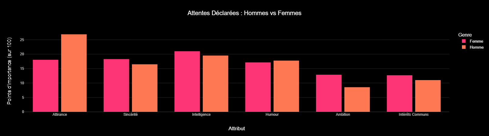
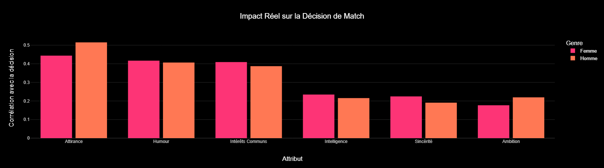
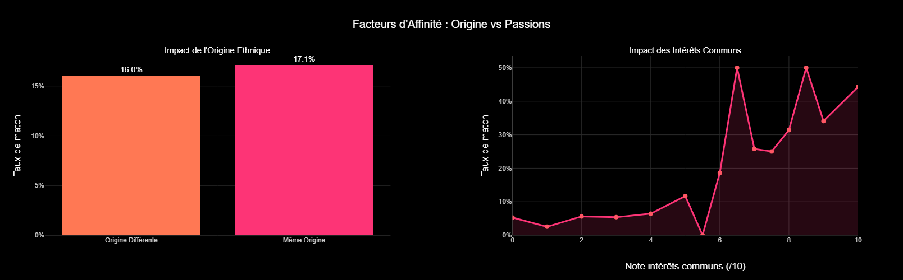
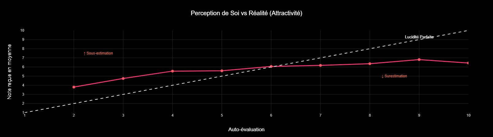

# Projet Speed Dating -- Analyse Exploratoire pour Tinder

[](#)
[](#)
[](#)
[](#)
[](#)
[](#)

---

## About

Projet réalisé dans le cadre de la certification **Jedha Bootcamp (Bloc 2 -- Analyse Exploratoire de Données)**.

L'équipe marketing de Tinder constate une baisse du nombre de matchs. Pour comprendre les mécanismes qui mènent à un "match", elle a organisé des sessions de **Speed Dating** accompagnées de questionnaires détaillés. L'objectif est d'identifier les facteurs réels du matching et de formuler des recommandations basées sur les données.

---

## Dataset

| Propriété | Valeur |
|-----------|--------|
| Source | Sessions de Speed Dating avec questionnaires |
| Volume | 8 378 rendez-vous, 195 variables |
| Après nettoyage | 8 267 lignes, 112 colonnes |
| Fichier | `data/Speed+Dating+Data.csv` |
| Documentation | `data/Speed+Dating+Data+Key.doc` |

---

## Installation

```bash
git clone https://github.com/athanormark/TINDER-_-BLOC-2_JEDHA_FORMATION.git
cd TINDER-_-BLOC-2_JEDHA_FORMATION
pip install -r requirements.txt
jupyter notebook notebook/TINDER.ipynb
```

---

## Pipeline

```
Dataset CSV (8 378 x 195)
   → Nettoyage (seuil 30 % NaN → 8 267 x 112)
      → Statistiques descriptives univariées (Pandas + NumPy)
         → Détection d'anomalies (boxplots)
            → Matrice de corrélation (np.corrcoef)
               → Visualisations interactives (Plotly / Seaborn)
                  → Recommandations stratégiques
```

---

## Résultats

### Préférences déclarées vs choix réels

<div align="center">
 
</div>

> **Gauche :** les femmes déclarent chercher l'intelligence. **Droite :** dans les faits, l'attirance physique est le critère n°1 pour tout le monde. Biais de désirabilité sociale classique.

### Passions communes vs origine ethnique

<div align="center">

</div>

> Même origine = ~17 % de match. Intérêts communs > 8/10 = **plus de 40 % de match**. L'algorithme devrait prioriser les hobbies, pas la démographie.

### Perception de soi vs réalité

<div align="center">

</div>

> Les modestes se sous-estiment, les confiants se surévaluent. La note reçue plafonne à ~7/10 quelle que soit l'auto-évaluation.

---

## Recommandations

- Miser sur le visuel (photo) : facteur déclencheur n°1 pour tous les genres, malgré les discours contraires.
- Encourager l'humour : levier comportemental le plus rentable en termes de matchs.
- Valoriser les hobbies : l'algorithme devrait prioriser les profils partageant les mêmes passions plutôt que les mêmes origines démographiques.
- Coaching profil : aider les utilisateurs à mieux s'évaluer (les modestes doivent prendre confiance, les confiants doivent soigner leur approche).

---

## Conclusion

L'analyse répond à la problématique de Tinder : **pourquoi le nombre de matchs baisse-t-il et comment l'algorithme peut-il être amélioré ?**

- L'attirance physique est le facteur déclencheur n°1 du matching pour les deux genres, malgré les préférences déclarées (biais de désirabilité sociale confirmé).
- Les intérêts communs > 8/10 produisent un taux de match **supérieur à 40 %**, contre seulement ~17 % pour la même origine ethnique. L'algorithme devrait prioriser les hobbies.
- Les utilisateurs se sur- ou sous-évaluent systématiquement ; un système de coaching de profil pourrait corriger ce biais.
- L'humour est le levier comportemental le plus rentable en termes de matchs.

**Limites** : le dataset provient de sessions de speed dating (face à face), pas d'un usage in-app. La transposition aux profils en ligne doit être validée.

---

## Structure du projet

```text
.
├── notebook/
│   └── TINDER.ipynb                    # Notebook complet d'analyse
├── data/
│   ├── Speed+Dating+Data.csv           # Dataset
│   └── Speed+Dating+Data+Key.doc       # Documentation des variables
├── img/                                # Graphiques exportés
├── requirements.txt
└── README.md
```

---

## Auteur

Athanor SAVOUILLAN · [GitHub](https://github.com/athanormark)
